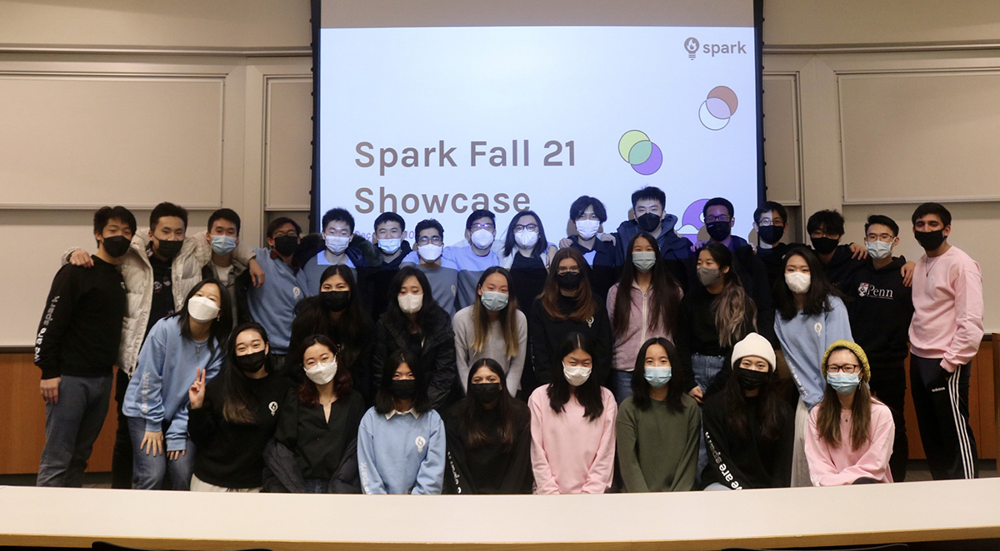

# Penn Spark

We’re a community of students at the University of Pennsylvania that bridge tech and design to build both creative and client projects from ground-up.

Each semester, our members come together to work on a variety of engineering and/or design projects. In the past, projects have ranged from redesigning a startup’s pilot program helping students with ADHD to developing a machine learning model that identifies pictures as emojis.

[Website](https://pennspark.org) | [Facebook](https://facebook.com/pennspark) | [Instagram](https://instagram.com/pennspark)| [Blog](https://medium.com/@pennspark)

